# 6. AI Engineering Design

## 6.1 AI Pipeline and Model Selection

### 6.1.1 Overview

The source-based verification feature (`backend/app/features/verification/`) is implemented as a **12-stage async pipeline**, orchestrated by `PipelineOrchestrator` (`pipeline/orchestrator.py`) and driven by a single mutable `PipelineContext` dataclass (`pipeline/context.py`) that is threaded through every stage. `VerificationService` (`service.py`) wires the concrete stage implementations and their dependencies (DB repositories, Redis cache, HTTP client, and the three ML services) and exposes the single public entry point `verify()`.

Design goals baked into the architecture:

- **Stage isolation** — each stage is a class satisfying the `PipelineStage` protocol (`stage_id` + `async execute(context) -> context`), independently testable and swappable.
- **Fault tolerance over completeness** — only 4 of 12 stages are *critical*; the rest degrade gracefully (empty scores, skipped flags) rather than aborting the run.
- **Cache-first short-circuit** — a claim-hash cache check (Stage 2) can skip the entire evidence-gathering and ML stack (Stages 3–12) entirely.
- **Cost-tiered ML usage** — cheap, cacheable bi-encoder similarity is used broadly; expensive cross-encoder models (reranker, NLI) are invoked only on small, already-filtered candidate sets.

### 6.1.2 Pipeline Flow

```mermaid
flowchart TD
    A["Input\nheadline · body · claimed_source · date"] --> S01

    S01["S01 · Normalizer 🔴\nBangla text normalization, source\nresolution, claim-hash generation"]
    S01 --> S02

    S02["S02 · Cache Lookup 🟡\nRedis → Postgres two-tier check\non claim_hash"]
    S02 -->|cache HIT| RESP["Build response directly\nfrom cached label/scores/articles"]
    S02 -->|cache MISS| S03

    S03["S03 · Query Generator 🟡\nSite-restricted / keyword / entity /\ndate-bound / body-summary queries"]
    S03 --> S04

    S04["S04 · Source Search 🟡\n5 providers in parallel:\nInternal-Site · NewsData.io ·\nGoogle CSE · DuckDuckGo · PyGoogleNews\n(URL canonicalize + dedupe + domain filter)"]
    S04 --> S05

    S05["S05 · Evidence Retrieval 🟡\nTier-1 httpx fetch (rate-limited/domain)\n→ Tier-2 Playwright (headless Chromium)\nfor JS-shell pages"]
    S05 --> S06

    S06["S06 · Article Extractor 🟡\n6-tier cascade: source CSS selectors →\nJSON-LD → Trafilatura → Readability →\nBeautifulSoup → OpenGraph meta"]
    S06 --> S07

    S07["S07 · Evidence Ranker 🟡 🤖\nLaBSE similarity + keyword/date/domain\ncomposite score → Cross-Encoder\nrerank (mMARCO-MiniLM) if >3 survive"]
    S07 --> S08

    S08["S08 · Similarity Analyzer 🟡 🤖\nLaBSE headline+body similarity ·\nBanglaBERT NER entity overlap ·\nkeyword overlap · numeral consistency"]
    S08 --> S09

    S09["S09 · Contradiction Detector 🟡 🤖\nDeBERTa-v3 NLI cross-encoder\n(entailment/contradiction/neutral),\ntemperature-calibrated"]
    S09 --> S10

    S10["S10 · Manipulation Detector 🟡 🤖\nLaBSE + BanglaBERT typed-entity swap +\nnumber-alteration rules →\n4 manipulation flags"]
    S10 --> S11

    S11["S11 · Classifier 🔴\nWeighted score aggregation (capped\nredistribution) + contradiction override\n→ TRUE / FALSE / PARTIALLY_TRUE /\nNOT_FOUND_IN_CLAIMED_SOURCE"]
    S11 --> S12

    S12["S12 · Persistence 🔴\nUpsert claim/result/articles/queries/logs ·\nRedis write-back · user notification"]
    S12 --> RESP

    RESP --> OUT["VerificationResponse\nlabel · confidence · reasoning ·\nscores · manipulation_flags · articles"]

    classDef critical fill:#3a2323,stroke:#e0736a,color:#fbe4e1,stroke-width:2px;
    classDef degradable fill:#20232b,stroke:#6b7280,color:#d8dce3,stroke-width:1px;
    classDef ai fill:#1b2a3d,stroke:#4f8fd1,color:#dbe9fb,stroke-width:2px;
    class S01,S11,S12 critical;
    class S02,S03,S04,S05,S06 degradable;
    class S07,S08,S09,S10 ai;
```

🔴 = **CRITICAL** stage (failure aborts the run, claim marked `FAILED`) · 🟡 = degradable (failure logged, pipeline continues) · 🤖 = invokes an ML model.

A polished, standalone version of this diagram (with the model roster and legend) is published as an artifact; see the link shared in the conversation.

### 6.1.3 Stage Reference

| # | Stage | Criticality | Degrade behaviour on failure | ML model used |
|---|-------|:---:|---|---|
| S01 | Normalizer | **CRITICAL** | None — no hash means no cache lookup or search is possible | — (rule-based Bangla normalizer, static/DB source-alias resolution) |
| S02 | Cache Lookup | Non-critical | Falls through to full pipeline (cache miss) | — |
| S03 | Query Generator | Non-critical | Falls back to a single raw-headline query | — (keyword/n-gram extraction) |
| S04 | Source Search | Non-critical | Zero candidates → later stages produce `NOT_FOUND_IN_CLAIMED_SOURCE` | — (5 external search clients) |
| S05 | Evidence Retrieval | Non-critical | Zero fetched pages → same NOT_FOUND path | — |
| S06 | Article Extractor | Non-critical | Zero extracted articles → same NOT_FOUND path | — |
| S07 | Evidence Ranker | Non-critical | Falls back to raw extraction order | **LaBSE** (bi-encoder) + **mMARCO Cross-Encoder** (conditional) |
| S08 | Similarity Analyzer | Non-critical | Scores remain `None`, degrade classifier weighting | **LaBSE** + **BanglaBERT NER** |
| S09 | Contradiction Detector | Non-critical | `contradiction_score` stays `None` | **DeBERTa-v3-small NLI** |
| S10 | Manipulation Detector | Non-critical | All 4 flags stay `False` | **LaBSE** + **BanglaBERT NER** (reused) |
| S11 | Classifier | **CRITICAL** | Without a label there is no result to return | — (deterministic scoring formula) |
| S12 | Persistence | **CRITICAL** | Result must be durably stored | — |

### 6.1.4 AI Model Selection

Four distinct pretrained models are used, each chosen for a specific cost/precision tradeoff rather than using one large model everywhere:

| Model | HuggingFace ID | Role | Stage(s) | Why this model |
|---|---|---|---|---|
| **LaBSE** | `sentence-transformers/LaBSE` | Bi-encoder sentence embedding (768-dim) | S07, S08, S10 | Language-agnostic BERT sentence embedding pretrained across 109 languages including Bangla. As a **bi-encoder** it lets every headline/article be embedded once and compared via cheap cosine dot-product, and every embedding is Redis-cached by text hash (`embedding_service.py`) — the only architecture that scales to comparing one claim against many candidate articles repeatedly across three separate stages. |
| **Cross-Encoder reranker** | `cross-encoder/mmarco-mMiniLMv2-L12-H384-v1` | Pairwise (claim, article) reranking | S07 only, gated | Cross-encoders jointly attend over the claim+article pair, giving materially better ranking precision than bi-encoder cosine similarity — but at O(n) forward passes instead of O(1) lookups, so it is deliberately **only invoked when more than 3 ranked candidates survive** the cheap composite score (`s07_evidence_ranker.py`). mMARCO's multilingual passage-ranking fine-tuning makes it suitable for Bangla news snippets without further fine-tuning. |
| **BanglaBERT NER** | `csebuetnlp/banglabert` (HF `ner` pipeline, `aggregation_strategy="simple"`) | Named-entity recognition (PER/LOC/ORG) | S08, S10 | Bangla-specific BERT (as opposed to a generic multilingual NER model) for reliable extraction of Bangla person/location/organisation spans. Used twice: to compute directional entity-overlap recall (S08) and to detect **same-type entity substitution** — e.g. a person swapped for another person of the same grammatical role — which a plain overlap score would miss (S10). |
| **DeBERTa-v3-small NLI** | `cross-encoder/nli-deberta-v3-small` | Textual entailment / contradiction | S09 only | A DeBERTa-v3 cross-encoder fine-tuned on MNLI + SNLI + FEVER, producing entailment/contradiction/neutral probabilities. A cross-encoder is required here (not LaBSE) because contradiction detection depends on fine-grained token-level interaction — e.g. one changed number or negation — that a bi-encoder's pooled cosine similarity cannot represent. Only ever called once per claim, against the single top-ranked article, keeping its cost bounded. |

**Model-tiering rationale.** The pipeline follows a **funnel pattern**: cheap, cacheable, broadly-applied signals (LaBSE cosine similarity, keyword overlap, date/domain heuristics) filter and rank a wide candidate set in S07; only the small surviving set is handed to progressively more expensive, more precise models — the cross-encoder reranker (top-N reordering) and finally the NLI cross-encoder (single top article only, in S09). This keeps per-claim latency bounded regardless of how many articles were retrieved, while still getting cross-encoder-level precision where it matters most (the final verdict).

**Calibration and degraded-mode handling** (`config.py: ClassificationThresholds`, `s09_contradiction_detector.py`):
- `nli_temperature = 1.5` — temperature-scaled softmax recalibration of the DeBERTa output logits, applied because the raw model is overconfident and produces false-positive contradictions right at the S11 soft-penalty threshold.
- `nli_title_only_attenuation = 0.6` — when an article's body could not be extracted, NLI falls back to a title-only premise and the resulting entailment/contradiction scores are multiplied by 0.6, since title-only NLI is known to be far less reliable than body-based NLI.
- The NLI premise itself is not the whole article body but the **top-5 claim-relevant sentences**, selected by token-overlap with the claim headline (`_select_claim_relevant_sentences`), to stay within DeBERTa's effective input window and keep the signal focused.

**Known inconsistency (config vs. runtime).** `MLSettings` in `core/config.py` declares configurable `embedding_model_name` (default `paraphrase-multilingual-mpnet-base-v2`) and `nli_model_name` (default `cross-encoder/nli-deberta-v3-base`) fields, but `EmbeddingService` and `NLIService` do not read them — they hardcode `sentence-transformers/LaBSE` and `cross-encoder/nli-deberta-v3-small` respectively as class constants. The settings fields are effectively dead configuration; the models actually loaded at startup are the hardcoded ones documented in the table above. This should be reconciled (either wire the services to the settings, or remove the unused fields) so the config accurately reflects the deployed models.

### 6.1.5 Non-ML Supporting Systems

**Search provider fan-out (S04).** Five providers are queried in parallel per query variant, with a fixed priority order used only to resolve URL-collision conflicts after dedup (lower number wins): `internal_site` (0) → `newsdata` (1) → `google_custom_search` (2) → `ddg` (3) → `py_google_news` (4). Each provider is selectively skipped per query type (e.g. NewsData never receives `HEADLINE`/`SITE_RESTRICTED` queries) to avoid wasted quota on query shapes it handles poorly.

**Two-tier extraction (S05).** Tier 1 is a fast `httpx` GET with a realistic browser `Accept-Language: bn-BD` header set and per-domain rate limiting (0.5s). Pages detected as JS-rendered shells (`__NEXT_DATA__`, `__NUXT__`, React root markers with <2000 chars of real text) escalate to Tier 2: a headless Playwright/Chromium render.

**Six-tier extraction cascade (S06).** For each fetched page: (1) source-specific CSS selectors from `source_registry.py` (11 known Bangla domains, each with hand-tuned title/body/date selectors) → (2) JSON-LD `NewsArticle`/`Article` structured data → (3) Trafilatura → (4) `python-readability` → (5) generic BeautifulSoup heuristics (common class-name patterns) → (6) OpenGraph/meta-description fallback. This directly addresses the fact that no single generic extractor reliably handles all 11+ target Bangla news sites.

**Verdict aggregation (S11).** The four availability-dependent scores (semantic similarity 0.45, entity match 0.25, keyword overlap 0.15, numerical consistency 0.15) are combined into an `evidence_score`, with any single dimension's *effective* weight capped at 0.65 and the excess redistributed proportionally across the remaining dimensions — preventing a claim with only one available signal (e.g. semantic similarity alone, if NER/NLI failed) from unilaterally deciding the verdict. A high contradiction score (>0.70) can override the weighted score directly to `FALSE`; a moderate one (>0.50) applies a soft penalty. Confidence is derived from the evidence score's distance to the nearest decision boundary via `0.5 + 0.47·(1 − e^(−15·distance))`, so verdicts near a threshold are reported with lower confidence than clear-cut ones.

**Two-tier caching (S02/S12).** Redis (fast path, JSON payload keyed by claim hash) backs onto Postgres (`verified_claims` + `verification_results`, keyed by the same hash) as a durable fallback; a Redis miss with a Postgres hit triggers a write-back to Redis. `force_refresh=True` bypasses both.

### 6.1.6 Observability

Every stage execution is timed (`context.stage_timings`) and logged with `structlog` (`stage_started` / `stage_completed` / `stage_failed_non_fatal`), then persisted as `VerificationLog` rows in S12 — giving per-claim, per-stage latency and error visibility without any separate profiling tooling.
