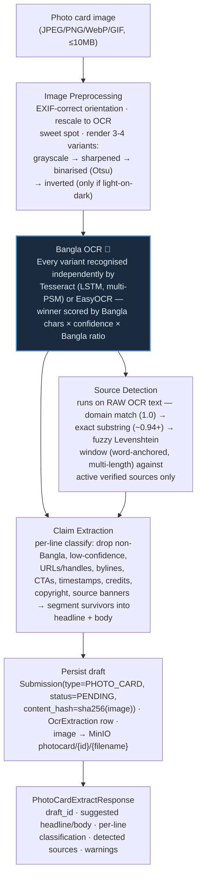
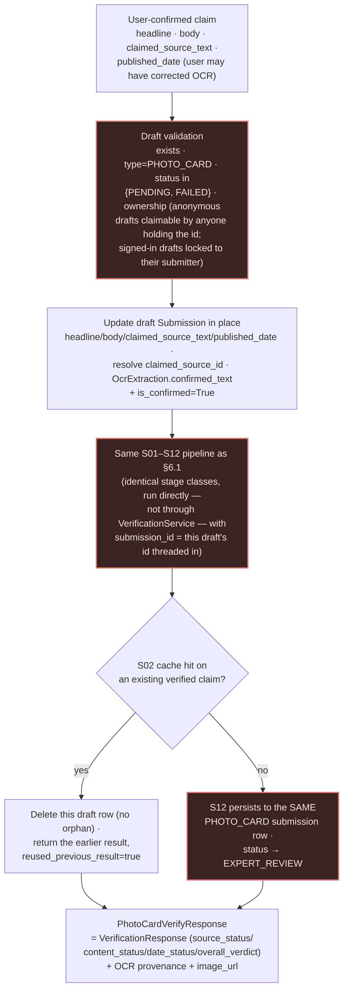

# 6. AI Engineering Design

## 6.1 AI Pipeline and Model Selection

### 6.1.1 Overview

The source-based verification feature (`backend/app/features/verification/`) is implemented as a **12-stage async pipeline**, orchestrated by `PipelineOrchestrator` (`pipeline/orchestrator.py`) and driven by a single mutable `PipelineContext` dataclass (`pipeline/context.py`) that is threaded through every stage. `VerificationService` (`service.py`) wires the concrete stage implementations and their dependencies (DB repositories, Redis cache, HTTP client, and the three ML services) and exposes the single public entry point `verify()`.

Design goals baked into the architecture:

- **Stage isolation** — each stage is a class satisfying the `PipelineStage` protocol (`stage_id` + `async execute(context) -> context`), independently testable and swappable.
- **Fault tolerance over completeness** — only 4 of 12 stages are *critical*; the rest degrade gracefully (empty scores, skipped flags) rather than aborting the run.
- **Cache-first short-circuit** — a claim-hash cache check (Stage 2) can skip the entire evidence-gathering and ML stack (Stages 3–12) entirely.
- **Cost-tiered ML usage** — cheap, cacheable bi-encoder similarity is used broadly; expensive cross-encoder models (reranker, NLI) are invoked only on small, already-filtered candidate sets.

### 6.1.2 Pipeline Flow


```mermaid
flowchart TD
    A["Input\nheadline · body · claimed_source · date"] --> S01

    S01["S01 · Normalizer 🔴\nBangla text normalization, source\nresolution, claim-hash generation"]
    S01 --> S02

    S02["S02 · Cache Lookup 🟡\nRedis → Postgres two-tier check\non claim_hash"]
    S02 -->|cache HIT| RESP["Build response directly\nfrom cached label/scores/articles"]
    S02 -->|cache MISS| S03

    S03["S03 · Query Generator 🟡\nSite-restricted / keyword / entity /\ndate-bound / body-summary queries"]
    S03 --> S04

    S04["S04 · Source Search 🟡\n5 providers in parallel:\nInternal-Site · NewsData.io ·\nGoogle CSE · DuckDuckGo · PyGoogleNews\n(URL canonicalize + dedupe + domain filter)"]
    S04 --> S05

    S05["S05 · Evidence Retrieval 🟡\nTier-1 httpx fetch (rate-limited/domain)\n→ Tier-2 Playwright (headless Chromium)\nfor JS-shell pages"]
    S05 --> S06

    S06["S06 · Article Extractor 🟡\n6-tier cascade: source CSS selectors →\nJSON-LD → Trafilatura → Readability →\nBeautifulSoup → OpenGraph meta"]
    S06 --> S07

    S07["S07 · Evidence Ranker 🟡 🤖\nLaBSE similarity + keyword/date/domain\ncomposite score → Cross-Encoder\nrerank (mMARCO-MiniLM) if >3 survive"]
    S07 --> S08

    S08["S08 · Similarity Analyzer 🟡 🤖\nLaBSE headline+body similarity ·\nBanglaBERT NER entity overlap ·\nkeyword overlap · numeral consistency"]
    S08 --> S09

    S09["S09 · Contradiction Detector 🟡 🤖\nDeBERTa-v3 NLI cross-encoder\n(entailment/contradiction/neutral),\ntemperature-calibrated"]
    S09 --> S10

    S10["S10 · Manipulation Detector 🟡 🤖\nLaBSE + BanglaBERT typed-entity swap +\nnumber-alteration rules →\n4 manipulation flags"]
    S10 --> S11

    S11["S11 · Classifier 🔴\nWeighted score aggregation (capped\nredistribution) + contradiction override\n→ TRUE / FALSE / PARTIALLY_TRUE /\nNOT_FOUND_IN_CLAIMED_SOURCE"]
    S11 --> S12

    S12["S12 · Persistence 🔴\nUpsert claim/result/articles/queries/logs ·\nRedis write-back · user notification"]
    S12 --> RESP

    RESP --> OUT["VerificationResponse\nlabel · confidence · reasoning ·\nscores · manipulation_flags · articles"]

    classDef critical fill:#3a2323,stroke:#e0736a,color:#fbe4e1,stroke-width:2px;
    classDef degradable fill:#20232b,stroke:#6b7280,color:#d8dce3,stroke-width:1px;
    classDef ai fill:#1b2a3d,stroke:#4f8fd1,color:#dbe9fb,stroke-width:2px;
    class S01,S11,S12 critical;
    class S02,S03,S04,S05,S06 degradable;
    class S07,S08,S09,S10 ai;
```

🔴 = **CRITICAL** stage (failure aborts the run, claim marked `FAILED`) · 🟡 = degradable (failure logged, pipeline continues) · 🤖 = invokes an ML model.

A polished, standalone version of this diagram (with the model roster and legend) is published as an artifact; see the link shared in the conversation.

### 6.1.3 Stage Reference

| # | Stage | Criticality | Degrade behaviour on failure | ML model used |
|---|-------|:---:|---|---|
| S01 | Normalizer | **CRITICAL** | None — no hash means no cache lookup or search is possible | — (rule-based Bangla normalizer, static/DB source-alias resolution) |
| S02 | Cache Lookup | Non-critical | Falls through to full pipeline (cache miss) | — |
| S03 | Query Generator | Non-critical | Falls back to a single raw-headline query | — (keyword/n-gram extraction) |
| S04 | Source Search | Non-critical | Zero candidates → later stages produce `NOT_FOUND_IN_CLAIMED_SOURCE` | — (5 external search clients) |
| S05 | Evidence Retrieval | Non-critical | Zero fetched pages → same NOT_FOUND path | — |
| S06 | Article Extractor | Non-critical | Zero extracted articles → same NOT_FOUND path | — |
| S07 | Evidence Ranker | Non-critical | Falls back to raw extraction order | **LaBSE** (bi-encoder) + **mMARCO Cross-Encoder** (conditional) |
| S08 | Similarity Analyzer | Non-critical | Scores remain `None`, degrade classifier weighting | **LaBSE** + **BanglaBERT NER** |
| S09 | Contradiction Detector | Non-critical | `contradiction_score` stays `None` | **DeBERTa-v3-small NLI** |
| S10 | Manipulation Detector | Non-critical | All 4 flags stay `False` | **LaBSE** + **BanglaBERT NER** (reused) |
| S11 | Classifier | **CRITICAL** | Without a label there is no result to return | — (deterministic scoring formula) |
| S12 | Persistence | **CRITICAL** | Result must be durably stored | — |

### 6.1.4 AI Model Selection

Four distinct pretrained models are used, each chosen for a specific cost/precision tradeoff rather than using one large model everywhere:

| Model | HuggingFace ID | Role | Stage(s) | Why this model |
|---|---|---|---|---|
| **LaBSE** | `sentence-transformers/LaBSE` | Bi-encoder sentence embedding (768-dim) | S07, S08, S10 | Language-agnostic BERT sentence embedding pretrained across 109 languages including Bangla. As a **bi-encoder** it lets every headline/article be embedded once and compared via cheap cosine dot-product, and every embedding is Redis-cached by text hash (`embedding_service.py`) — the only architecture that scales to comparing one claim against many candidate articles repeatedly across three separate stages. |
| **Cross-Encoder reranker** | `cross-encoder/mmarco-mMiniLMv2-L12-H384-v1` | Pairwise (claim, article) reranking | S07 only, gated | Cross-encoders jointly attend over the claim+article pair, giving materially better ranking precision than bi-encoder cosine similarity — but at O(n) forward passes instead of O(1) lookups, so it is deliberately **only invoked when more than 3 ranked candidates survive** the cheap composite score (`s07_evidence_ranker.py`). mMARCO's multilingual passage-ranking fine-tuning makes it suitable for Bangla news snippets without further fine-tuning. |
| **BanglaBERT NER** | `csebuetnlp/banglabert` (HF `ner` pipeline, `aggregation_strategy="simple"`) | Named-entity recognition (PER/LOC/ORG) | S08, S10 | Bangla-specific BERT (as opposed to a generic multilingual NER model) for reliable extraction of Bangla person/location/organisation spans. Used twice: to compute directional entity-overlap recall (S08) and to detect **same-type entity substitution** — e.g. a person swapped for another person of the same grammatical role — which a plain overlap score would miss (S10). |
| **DeBERTa-v3-small NLI** | `cross-encoder/nli-deberta-v3-small` | Textual entailment / contradiction | S09 only | A DeBERTa-v3 cross-encoder fine-tuned on MNLI + SNLI + FEVER, producing entailment/contradiction/neutral probabilities. A cross-encoder is required here (not LaBSE) because contradiction detection depends on fine-grained token-level interaction — e.g. one changed number or negation — that a bi-encoder's pooled cosine similarity cannot represent. Only ever called once per claim, against the single top-ranked article, keeping its cost bounded. |

**Model-tiering rationale.** The pipeline follows a **funnel pattern**: cheap, cacheable, broadly-applied signals (LaBSE cosine similarity, keyword overlap, date/domain heuristics) filter and rank a wide candidate set in S07; only the small surviving set is handed to progressively more expensive, more precise models — the cross-encoder reranker (top-N reordering) and finally the NLI cross-encoder (single top article only, in S09). This keeps per-claim latency bounded regardless of how many articles were retrieved, while still getting cross-encoder-level precision where it matters most (the final verdict).

**Calibration and degraded-mode handling** (`config.py: ClassificationThresholds`, `s09_contradiction_detector.py`):
- `nli_temperature = 1.5` — temperature-scaled softmax recalibration of the DeBERTa output logits, applied because the raw model is overconfident and produces false-positive contradictions right at the S11 soft-penalty threshold.
- `nli_title_only_attenuation = 0.6` — when an article's body could not be extracted, NLI falls back to a title-only premise and the resulting entailment/contradiction scores are multiplied by 0.6, since title-only NLI is known to be far less reliable than body-based NLI.
- The NLI premise itself is not the whole article body but the **top-5 claim-relevant sentences**, selected by token-overlap with the claim headline (`_select_claim_relevant_sentences`), to stay within DeBERTa's effective input window and keep the signal focused.

**Known inconsistency (config vs. runtime).** `MLSettings` in `core/config.py` declares configurable `embedding_model_name` (default `paraphrase-multilingual-mpnet-base-v2`) and `nli_model_name` (default `cross-encoder/nli-deberta-v3-base`) fields, but `EmbeddingService` and `NLIService` do not read them — they hardcode `sentence-transformers/LaBSE` and `cross-encoder/nli-deberta-v3-small` respectively as class constants. The settings fields are effectively dead configuration; the models actually loaded at startup are the hardcoded ones documented in the table above. This should be reconciled (either wire the services to the settings, or remove the unused fields) so the config accurately reflects the deployed models.

### 6.1.5 Non-ML Supporting Systems

**Search provider fan-out (S04).** Five providers are queried in parallel per query variant, with a fixed priority order used only to resolve URL-collision conflicts after dedup (lower number wins): `internal_site` (0) → `newsdata` (1) → `google_custom_search` (2) → `ddg` (3) → `py_google_news` (4). Each provider is selectively skipped per query type (e.g. NewsData never receives `HEADLINE`/`SITE_RESTRICTED` queries) to avoid wasted quota on query shapes it handles poorly.

**Two-tier extraction (S05).** Tier 1 is a fast `httpx` GET with a realistic browser `Accept-Language: bn-BD` header set and per-domain rate limiting (0.5s). Pages detected as JS-rendered shells (`__NEXT_DATA__`, `__NUXT__`, React root markers with <2000 chars of real text) escalate to Tier 2: a headless Playwright/Chromium render.

**Six-tier extraction cascade (S06).** For each fetched page: (1) source-specific CSS selectors from `source_registry.py` (11 known Bangla domains, each with hand-tuned title/body/date selectors) → (2) JSON-LD `NewsArticle`/`Article` structured data → (3) Trafilatura → (4) `python-readability` → (5) generic BeautifulSoup heuristics (common class-name patterns) → (6) OpenGraph/meta-description fallback. This directly addresses the fact that no single generic extractor reliably handles all 11+ target Bangla news sites.

**Verdict aggregation (S11).** The four availability-dependent scores (semantic similarity 0.45, entity match 0.25, keyword overlap 0.15, numerical consistency 0.15) are combined into an `evidence_score`, with any single dimension's *effective* weight capped at 0.65 and the excess redistributed proportionally across the remaining dimensions — preventing a claim with only one available signal (e.g. semantic similarity alone, if NER/NLI failed) from unilaterally deciding the verdict. A high contradiction score (>0.70) can override the weighted score directly to `FALSE`; a moderate one (>0.50) applies a soft penalty. Confidence is derived from the evidence score's distance to the nearest decision boundary via `0.5 + 0.47·(1 − e^(−15·distance))`, so verdicts near a threshold are reported with lower confidence than clear-cut ones.

**Two-tier caching (S02/S12).** Redis (fast path, JSON payload keyed by claim hash) backs onto Postgres (`verified_claims` + `verification_results`, keyed by the same hash) as a durable fallback; a Redis miss with a Postgres hit triggers a write-back to Redis. `force_refresh=True` bypasses both.

### 6.1.6 Observability

Every stage execution is timed (`context.stage_timings`) and logged with `structlog` (`stage_started` / `stage_completed` / `stage_failed_non_fatal`), then persisted as `VerificationLog` rows in S12 — giving per-claim, per-stage latency and error visibility without any separate profiling tooling.

### 6.1.7 API Entry Points & End-to-End Request Flow

A text claim reaches the pipeline through one of two endpoints (`verification/router.py`), both backed by the identical `VerificationService`/stage list — only the calling convention differs:

```
POST /verify            synchronous — the request blocks until S01–S12 finish
                         and the full VerificationResponse comes back in one reply.

POST /verify/async       the path the frontend actually uses — returns 202
                         immediately with {submission_id, status, cached}
                         and runs the pipeline in the background.
GET  /verify/{id}         poll this for the result once it's ready.
GET  /verify/{id}/status  lighter poll — status only, result included once
                           the submission reaches EXPERT_REVIEW/FINALIZED.
GET  /submissions/{id}    type-agnostic lookup shared by all three
                           verification methods (source-based, photo-card,
                           multimodal) — tells a result page which of the
                           three detail endpoints to call next.
```

`POST /verify/async`'s immediate duplicate check (`VerificationService.register_claim`) recomputes the claim hash from the normalised headline + canonical source domain and looks for an **already-verified** submission with that same hash; a hit returns `cached: true` with the existing `submission_id` and schedules no work at all — the full S01–S12 run only ever happens once per distinct claim unless `force_refresh=True`. On a miss, a `Submission` row is created in `PENDING` immediately and `schedule_verification_job` (`jobs.py`) hands the pipeline to `asyncio.create_task`, gated by a 2-slot semaphore — the pipeline has CPU-bound stretches (embeddings, HTML parsing) that don't yield, so letting every queued claim start at once was observed to starve the event loop badly enough that a 0.15s acknowledgement took seconds to reach the client.

```
User submits claim
    → POST /verify/async → Submission(PENDING) created, 202 returned at once
    → background job: S01 Normalizer … S12 Persistence (§6.1.2) runs unattended
    → S12 flips status → EXPERT_REVIEW, fires a "Verification Complete"
      notification to the submitter and an "available for review" notification
      to every active expert (§6.1.9)
    → the result page (having navigated away and back, or having stayed and
      polled) calls GET /submissions/{id} then GET /verify/{id} and renders
      the verdict (§6.1.10)
```

This two-endpoint split exists specifically so the submitter is never forced to sit on the submission page for the run's full duration — they can navigate to Fact Explorer, their submission history, or away from the app entirely and come back to a notification.

### 6.1.8 Database & Storage

| Table / store | Role for a text claim |
|---|---|
| `submissions` | One row, `submission_type = SOURCE_BASED`, carrying the headline/body/claimed_source_text/published_date and the lifecycle `status` (`PENDING` → `PROCESSING` → `EXPERT_REVIEW` → `FINALIZED`/`ESCALATED`/`FAILED`) |
| `verification_results_v2` | The AI verdict, **immutable** once S11/S12 write it: `source_status`/`content_status`/`date_status`, plus the five similarity/consistency scores and `reasoning`. Expert review never touches these columns — it writes `final_source_status`/`final_content_status`/`final_date_status`/`overall_verdict`/`finalized_at` instead (§6.1.9), so the AI's original call stays inspectable even after the claim is Expert Verified |
| `retrieved_articles_v2`, `source_evidence_queries` | The evidence trail — every article a search provider returned and every query that was run to find it, kept for audit and for the expert queue's "top matching article" panel |
| `verification_logs` | Per-stage timing/success rows written in S12 (§6.1.6) |
| `notifications` | `VERIFICATION_COMPLETE` (to the submitter) and `EXPERT_REVIEW_AVAILABLE` (broadcast to every active expert) rows, written by S12 the moment the AI preliminary result lands |
| Redis | Fast-path cache keyed by claim hash, backing onto the Postgres tables above as the durable fallback (§6.1.5) |

### 6.1.9 Expert Review Integration

A text claim is one of the two `_STRUCTURED_TYPES` in `ExpertReviewService` (the other being `PHOTO_CARD`, §6.2.9) — the voting engine does not distinguish between them. Once S12 flips a submission to `EXPERT_REVIEW`, it is simultaneously visible in the expert queue and in the Fact Explorer's preliminary section, and every subsequent step is the shared engine:

- **The vote itself** mirrors the AI's own structure: Source (Confirmed/Not Found) first, then — only when Source is Confirmed — Content (Matched/Altered) and Date (Matched/Mismatched); every submission type additionally casts one Overall verdict (Fake/Real/Misleading/Altered), cast in the same form as the structured vote.
- **Weighting** resolves from the expert's credibility tier once they've completed the admin-configured activation threshold `N` of lifetime reviews (weight is a flat 1.0 before that); the resolved weight is snapshotted onto the vote row (`credibility_weight`) so a later tier change never retroactively rewrites history.
- **Finalization** requires every applicable dimension — Overall always, Source/Content/Date for this type — to independently clear all three of: leading verdict's weighted score ≥ `T`, votes cast ≥ `M`, lead over the runner-up ≥ `margin`. A claim that exhausts the configured review window or vote cap without clearing them escalates to admin instead of hanging open.
- **Concurrency** is handled by row-locking the submission for the duration of a vote-or-edit-plus-finalize decision, so two experts voting at the same moment can't double-finalize.
- Every vote cast/edited, finalization, and escalation is written to the append-only `audit_log`.

The one respect in which a text claim's review screen differs from a photo card's is simply that there is no uploaded image to show — the expert's left-hand context is the submitted headline/body/claimed source plus the **top-ranked matched article** (`RetrievedArticleV2`, fetched the same way for both structured types), not a card thumbnail. `source_status`/`content_status`/`date_status` on the result row are never touched by finalization — they stay exactly as the AI computed them — while `final_source_status`/`final_content_status`/`final_date_status`/`overall_verdict` are written only once expert review finalizes, letting the claim's detail page show an "experts changed this verdict from X to Y" banner whenever the two disagree (`VerificationResponse.was_overridden`).

### 6.1.10 Result Display — Showing the User Their Verdict

The frontend's `/verify/:id` route is type-dispatching: it calls `GET /submissions/{id}` first to learn which of the three verification methods produced this submission, then polls the matching detail endpoint (`GET /verify/{id}` for a text claim) until a verdict exists, re-polling every few seconds while the submission sits in `PENDING`/`PROCESSING` so a user who stayed on the page sees the result land without a refresh — and a user who navigated away and comes back via a notification link, their submission history, or Fact Explorer gets the identical page in whatever state the claim is actually in.

Once a verdict exists, the page shows, top to bottom: an "⏳ Under Review" or "⚖️ Expert Verified" chip next to the Overall verdict badge; the structured Source/Content/Date badges beneath it; a confidence ring; the AI's plain-text `reasoning`; the per-dimension score bars (semantic similarity, entity match, keyword overlap, numerical consistency, contradiction); the manipulation-flag checklist; the top matched article with a link back to the source; and — once expert review has finalized a verdict that differs from the AI's own — the override banner described in §6.1.9. The same Overall verdict and Under-Review/Expert-Verified distinction is what the Fact Explorer's list view and filters key off of, so a claim reads consistently whether a user finds it via its own link, a notification, or by browsing.

## 6.2 Photo-Card Verification Pipeline

### 6.2.1 Overview

The photo-card feature (`backend/app/features/photocard/`) verifies a **screenshot of a news photo card** rather than typed text. It does not implement a second verification engine — `PhotoCardService` (`service.py`) is a two-step front end that (1) recovers a clean, verifiable Bangla claim from the image via OCR, chrome-stripping and segmentation, then (2) hands that claim to the **exact same 12-stage pipeline** documented in §6.1, stage-for-stage, so that a photo-card verdict is defensible on the same terms as a typed claim submitted through `POST /verify`.

```
Step 1 — EXTRACT  (POST /photocard/extract)   nothing is verified yet
    image bytes → preprocessing variants → OCR → source detection (raw text)
    → claim extraction (chrome stripped, headline/body segmented)
    → draft Submission persisted (PENDING) + OcrExtraction row + MinIO upload
    → PhotoCardExtractResponse returned for the user to review and correct

Step 2 — VERIFY  (POST /photocard/verify)     the user has confirmed the text
    confirmed headline/body/source/date → draft Submission updated in place
    → the same S01–S12 pipeline from §6.1, run directly against this
      PHOTO_CARD submission (not a second SOURCE_BASED row)
    → PhotoCardVerifyResponse: a VerificationResponse, identical in shape
      to a typed claim's
```

Splitting extraction from verification exists because OCR is unreliable enough that the user must be the final authority on what the card actually says before anything gets checked against a news source — verifying a mis-read headline would produce a confident, wrong answer.

### 6.2.2 Step 1 — Extraction Flow


```mermaid
flowchart TD
    IMG["Photo card image\n(JPEG/PNG/WebP/GIF, ≤10MB)"] --> PRE

    PRE["Image Preprocessing\nEXIF-correct orientation · rescale to OCR\nsweet spot · render 3-4 variants:\ngrayscale → sharpened → binarised (Otsu)\n→ inverted (only if light-on-dark)"]
    PRE --> OCR

    OCR["Bangla OCR 🤖\nEvery variant recognised independently by\nTesseract (LSTM, multi-PSM) or EasyOCR —\nwinner scored by Bangla chars × confidence × Bangla ratio"]
    OCR --> SRC
    OCR --> CLAIM

    SRC["Source Detection\nruns on RAW OCR text — domain match (1.0) →\nexact substring (~0.94+) → fuzzy Levenshtein\nwindow (word-anchored, multi-length) against\nactive verified sources only"]
    SRC --> CLAIM

    CLAIM["Claim Extraction\nper-line classify: drop non-Bangla, low-confidence,\nURLs/handles, bylines, CTAs, timestamps, credits,\ncopyright, source banners → segment survivors into\nheadline + body"]
    CLAIM --> DRAFT

    DRAFT["Persist draft\nSubmission(type=PHOTO_CARD, status=PENDING,\ncontent_hash=sha256(image)) · OcrExtraction row ·\nimage → MinIO photocard/{id}/{filename}"]
    DRAFT --> OUT["PhotoCardExtractResponse\ndraft_id · suggested headline/body · per-line\nclassification · detected sources · warnings"]

    classDef ai fill:#1b2a3d,stroke:#4f8fd1,color:#dbe9fb,stroke-width:2px;
    class OCR ai;
```

Nothing in this step touches the verification pipeline or writes a `VerificationResultV2` row — only a draft `Submission` and its `OcrExtraction` exist afterward, and the submission stays `PENDING` until the user confirms it.

### 6.2.3 Image Preprocessing (`image_preprocessor.py`)

Pillow + NumPy only, no OpenCV. Photo cards are screenshots and social graphics, not scans: text is crisp but often small and tightly kerned, and the Bangla *matra* (the connecting headline stroke) merges adjacent glyphs under downscaling or JPEG blur, which makes a single fixed recipe unreliable. Instead, a handful of cheap variants are rendered and the OCR stage below picks whichever one it could actually read the most Bangla from:

| Variant | Transform | Why |
|---|---|---|
| `grayscale` | Resize into the OCR-friendly resolution band (LANCZOS upscale / BICUBIC downscale) + autocontrast | Safe baseline |
| `sharpened` | Unsharp mask (radius 2.0, 180%) | Re-separates matra-merged glyphs |
| `binarised` | Otsu threshold (computed from the 256-bin histogram, between-class variance maximised) | Helps flat-background infographic cards; hurts photographic ones, hence a candidate rather than the default |
| `inverted` | Only rendered when border-pixel sampling detects light-on-dark | Engines trained on dark-on-light text read nothing at all otherwise |

### 6.2.4 Bangla OCR (`ocr_service.py`)

Two interchangeable engines sit behind one interface, neither imported at module load time — a missing engine surfaces as a `503 OcrEngineUnavailableError` on the photo-card endpoints instead of failing application startup:

- **Tesseract** (preferred, `OEM 1` LSTM engine) — tried at every configured PSM mode per variant, requires the `ben` traineddata.
- **EasyOCR** (fallback) — a general multilingual reader.

Every preprocessing variant is recognized by the resolved engine independently; the outputs are not merged but scored and the single best one wins:

```
score = bangla_char_count × (0.5 + 0.5 × confidence) × bangla_ratio(text)
```

Character count alone would favour a pass that hallucinates long garbage strings; confidence alone would favour a pass that reads three clean words and misses the headline — the product balances both. Each engine's raw output (Tesseract's per-word boxes grouped by `page/block/par/line`; EasyOCR's independent boxes bucketed by vertical overlap and sorted left-to-right within each bucket) is normalised into the same `OcrLine`/`OcrOutput` shape so the rest of the pipeline is engine-agnostic. A card with no recoverable Bangla text raises `422 OcrFailedError`.

### 6.2.5 Source Detection (`source_detector.py`)

Nearly every circulating photo card brands itself — a logo, a wordmark strip, a page URL — and that branding *is* the claim's source attribution. Detection deliberately runs against the **raw** OCR text (before claim cleaning throws the banner away), against **active verified sources only**, in three strategies of decreasing trust:

1. **`domain`** (confidence 1.0) — a URL or bare domain in the text resolves to a source's canonical name or base-URL domain. Unambiguous when present.
2. **`exact`** (~0.94–1.0) — a source's display name, English name, canonical name, or any configured alias appears verbatim in the normalised text.
3. **`fuzzy`** (Levenshtein ratio against a configurable threshold) — carries the detector in practice, since Bangla OCR routinely drops a matra or splits a conjunct (`প্রথম আলো` → `প্রথম আল৷`). Candidate windows are anchored to word starts (not every character offset) and tried at several lengths around the needle's own length, since OCR both drops and inserts characters relative to the true match span.

Results are ranked by confidence; the top one becomes `primary_source` only if it clears a separate, higher auto-select threshold — otherwise the user is shown all candidates and must pick (or type) one manually, with a warning surfaced.

### 6.2.6 Claim Extraction (`claim_extractor.py`)

A typical card is mostly *not* the claim: outlet banner, one-to-three-line headline, maybe a supporting sentence, then a band of chrome — social handles, "লাইক / শেয়ার / ফলো করুন" prompts, bylines, photo credits, timestamps, engagement counters, copyright, ads. Feeding all of that into the verification pipeline dilutes the embedding and drags entity matching toward the outlet's own name rather than the claim. Each OCR line is classified and, if it's chrome, tagged with why:

| Noise reason | Trigger |
|---|---|
| `empty`, `no_letters`, `too_short`, `low_confidence`, `not_bangla` | Structural / quality filters |
| `url`, `social_handle`, `phone_number` | Pure decoration once stripped |
| `social_cta`, `byline`, `credit`, `timestamp`, `engagement`, `copyright`, `advert` | Pattern-matched furniture specific to Bangladeshi news cards |
| `source_banner` | Line is (or Levenshtein-close to) a detected outlet's own name — matched using the **same** `source_names` list §6.2.5 detected, so a banner is removed using whichever garbled spelling OCR actually produced |

Surviving lines are joined and segmented into headline + body: the headline grows line-by-line while it still reads as a headline (stops at a sentence-ending danda/punctuation once long enough to stand alone, or at a hard character cap), with a single-paragraph fallback that splits on the first sentence boundary instead when the card has no visual line breaks. Warnings (very short headline, low-confidence lines dropped, no survivable text, no source detected) are returned to the user rather than silently guessed past — they are the one who reviews and corrects this before anything is verified.

### 6.2.7 Step 2 — Verification Flow (shared pipeline reuse)


```mermaid
flowchart TD
    CONF["User-confirmed claim\nheadline · body · claimed_source_text ·\npublished_date (user may have corrected OCR)"] --> VAL

    VAL["Draft validation\nexists · type=PHOTO_CARD · status in\n{PENDING, FAILED} · ownership (anonymous\ndrafts claimable by anyone holding the id;\nsigned-in drafts locked to their submitter)"]
    VAL --> UPD

    UPD["Update draft Submission in place\nheadline/body/claimed_source_text/published_date ·\nresolve claimed_source_id · OcrExtraction.confirmed_text\n+ is_confirmed=True"]
    UPD --> PIPE

    PIPE["Same S01–S12 pipeline as §6.1\n(identical stage classes, run directly —\nnot through VerificationService — with\nsubmission_id = this draft's id threaded in)"]

    PIPE --> HIT{"S02 cache hit on\nan existing verified claim?"}
    HIT -->|yes| DUP["Delete this draft row (no orphan) ·\nreturn the earlier result,\nreused_previous_result=true"]
    HIT -->|no| PERSIST["S12 persists to the SAME\nPHOTO_CARD submission row ·\nstatus → EXPERT_REVIEW"]

    DUP --> OUT["PhotoCardVerifyResponse\n= VerificationResponse (source_status/\ncontent_status/date_status/overall_verdict)\n+ OCR provenance + image_url"]
    PERSIST --> OUT

    classDef critical fill:#3a2323,stroke:#e0736a,color:#fbe4e1,stroke-width:2px;
    class VAL,PIPE,PERSIST critical;
```

The pipeline is driven directly (`PhotoCardService._build_stages()` assembles the identical `InputNormalizerStage ... PersistenceStage` list `VerificationService` builds for `POST /verify`) rather than through `VerificationService`, specifically so the draft's existing submission ID can be threaded into the `PipelineContext`. That keeps the submission typed `PHOTO_CARD` with its `OcrExtraction` attached end-to-end, instead of the shared pipeline creating a second `SOURCE_BASED` row alongside it. Duplicate detection (S02) behaves exactly as it does for a typed claim: a cache hit on an already-verified claim redirects the response to that result and the orphaned draft row is deleted, mirroring how the source-based flow never creates a duplicate row either.

Because every downstream stage is the literal same code path as §6.1, a photo card gets the identical 3-dimensional AI verdict — `source_status` (Confirmed/Not Found), `content_status` (Matched/Altered, only when source is Confirmed), `date_status` (Matched/Mismatched) — plus the derived Overall verdict (Fake/Real/Misleading/Altered), the same evidence search restricted to the claimed source, the same LaBSE/BanglaBERT/DeBERTa similarity, contradiction and manipulation checks, and the same weighted-score classifier.

### 6.2.8 Database & Storage

No photo-card-specific result table exists — a photo card's AI verdict lives in the **same** `verification_results_v2` row shape a typed claim uses:

| Table | Role for a photo card |
|---|---|
| `submissions` | One row, `submission_type = PHOTO_CARD`, carrying the confirmed headline/body/claimed_source_text/published_date and the lifecycle `status` (`PENDING` → `EXPERT_REVIEW` → `FINALIZED`/`ESCALATED`) |
| `ocr_extractions` | Photo-card-only: `image_object_key`, `raw_extracted_text`, `confirmed_text`, `ocr_confidence`, `ocr_engine`, `is_confirmed` — one row per submission |
| `verification_results_v2` | AI verdict, **immutable** once written by S11/S12: `source_status`/`content_status`/`date_status`. Expert review never overwrites these — it writes `final_source_status`/`final_content_status`/`final_date_status`/`overall_verdict`/`finalized_at` instead, so the AI's original call stays inspectable after the claim moves to Expert Verified |
| `retrieved_articles_v2`, `source_evidence_queries` | Evidence trail — identical shape and population path to a typed claim |
| MinIO (object storage) | The uploaded card image, under its own `photocard/{submission_id}/{filename}` prefix — a separate bucket-service instance (`PhotoCardStorageService`) from the multimodal feature's images, so the two can be retained/expired/audited independently. Served back only as short-lived presigned URLs, never a public path |

The draft's `content_hash` is provisionally the image's SHA-256 digest (the real claim hash can't be known until the user confirms the text); S01 recomputes the canonical claim hash from the confirmed headline + source once verification actually runs.

### 6.2.9 Expert Review Integration

Photo-card submissions are **not** a special case in `ExpertReviewService` — they're one of the two `_STRUCTURED_TYPES` (alongside `SOURCE_BASED`), sharing every code path described in §4's voting engine: the same Source→Content/Date hierarchical vote (Content/Date become N/A the moment Source's winning verdict is Not Found), the same Overall (Fake/Real/Misleading/Altered) vote every submission type casts, and the same weighted T/M/margin finalization, credibility updates, and audit logging.

The one genuinely photo-card-specific piece is **image surfacing**: the expert queue and review-detail screen fetch the submission's `OcrExtraction.image_object_key` and resolve it to a presigned MinIO URL (`ExpertReviewService._fetch_photocard_image_url`, wired through a `PhotoCardStorageService` instance injected alongside the existing multimodal one) so an expert reviewing a photo-card claim sees the actual card next to the AI's preliminary verdict and the matched source article — not just OCR'd text in isolation. The Fact Explorer and the public claim-detail page (`GET /photocard/{id}`) surface the same image as a thumbnail/hero image respectively, through the identical presigned-URL mechanism.

Because the AI verdict and the expert-finalized verdict are stored in separate columns (§6.2.8), a photo card's detail page can show both: the AI's original call, and — once expert review completes — a "experts changed this verdict from X to Y" banner when the two disagree (`VerificationResponse.was_overridden`).

### 6.2.10 Error Handling & Degradation

| Failure | Behaviour |
|---|---|
| No OCR engine installed/configured | `503 OcrEngineUnavailableError` at request time; app still boots (lazy init) |
| Image has no recoverable Bangla text | `422 OcrFailedError` |
| MinIO unavailable during upload | Extraction proceeds (OCR works off in-memory bytes); the response carries a warning and `image_url: null` instead of failing the request |
| No active verified source matched | `detected_sources` is empty; user must type/select the claimed source manually, with a warning surfaced |
| Draft already verified / wrong owner / wrong type | `409`/`403`/`404` on `POST /photocard/verify`, before the pipeline ever runs |
| Pipeline stage failure (S01/S11/S12 critical) | Same as §6.1 — `500 PipelineError`; non-critical stage failures degrade silently exactly as they do for a typed claim |

### 6.2.11 Observability

Since Step 2 runs the literal same stage instances as `POST /verify`, every photo-card verification gets the same per-stage `stage_timings` + `structlog` `stage_started`/`stage_completed`/`stage_failed_non_fatal` events and `VerificationLog` rows described in §6.1.6. Step 1 adds its own OCR-specific structured events — `photocard_ocr_engine_ready`, `photocard_ocr_variant_scored` (per variant, with its Bangla-char count and confidence), `photocard_extract_complete` (kept/removed line counts, detected source), `photocard_verify_started`, `photocard_duplicate_detected` — giving the same per-claim visibility into the extraction half of the flow that the pipeline already provides for the verification half.
