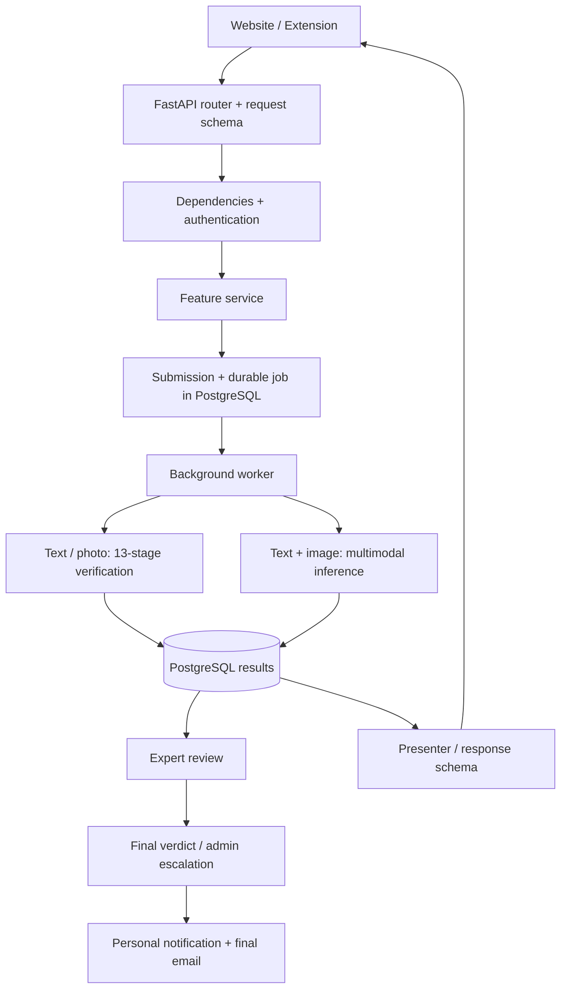

# BanglaFactGuard backend — presentation study guide

প্রস্তুত: ৯ অক্টোবর ২০২৬। এই guide বর্তমান source code-এর static inspection থেকে তৈরি; live database, deployed configuration বা model accuracy পরীক্ষা করা হয়নি। `.env`-এর secret পড়া হয়নি। নিচে বলা configuration values code-এর default; deployment-এ override থাকতে পারে।

এই guide-এ backend-এর ধারণা ও flow বোঝানো হয়েছে। পাশাপাশি [সম্পূর্ণ file/function reference](<E:/8th Sem/SPL3/Main/BanglaFactGuard/docs/backend-file-reference-bn.md>)-এ প্রতিটি Python file, class/function, schema field, entity relationship, route, migration ও test-এর বিস্তারিত index রয়েছে। মোট ২৯৭টি Python file, ১,৭২৩টি class/function declaration ও ৬১টি API route index করা হয়েছে। Reference-টি lookup-এর জন্য; প্রথমবার এই study guide-টিই ধারাবাহিকভাবে পড়বে।

## ১. তোমার project আসলে কী করে?

BanglaFactGuard বাংলা সংবাদ/দাবি যাচাইয়ে সাহায্য করে। তিনভাবে input দেওয়া যায়:

| পদ্ধতি | ব্যবহারকারীর input | backend-এর কাজ | automatic output |
|---|---|---|---|
| Text & source | headline, optional body/source/date | উৎসের খবর খোঁজা, মূল খবরের সঙ্গে headline/body/date তুলনা | source finding, headline finding, date finding, optional body scores |
| Photo card | একটি image | Gemini দিয়ে headline/outlet/date পড়া, তারপর source-based pipeline | extraction details + source/headline/date findings |
| Text & image | headline, body, image | BanglaBERT দিয়ে body ও EfficientNet-B4 দিয়ে image বিশ্লেষণ | FAKE / NON_FAKE preliminary prediction ও confidence |

সব পদ্ধতিতেই final overall verdict expert review থেকে আসে: `REAL`, `FAKE`, `MISLEADING`, `ALTERED`। AI-এর output preliminary। `CONFIRMED` মানে সংশ্লিষ্ট উৎসে মিলযুক্ত report পাওয়া গেছে; ঘটনাটি নিঃসন্দেহে সত্য প্রমাণিত হয়েছে—এমন দাবি নয়।

## ২. আগে ছয়টি শব্দ বোঝো

| শব্দ | সহজ অর্থ | এখানে উদাহরণ |
|---|---|---|
| Router | কোন URL-এ কোন function চলবে | `POST /api/v1/verify/async` → `verify_claim_async()` |
| Schema / DTO | API-তে কী data নেওয়া/ফেরত দেওয়া যাবে | `VerificationRequest`, `VerificationResponse` |
| Entity / ORM model | database table-এর Python representation | `Submission` → `submissions` |
| Service | feature-এর কাজ ও নিয়ম পরিচালনা করে | `VerificationService.register_claim()` |
| Repository | database query ও record পরিবর্তন করে | `SubmissionRepository.get_by_id()` |
| Dependency injection | function-এর প্রয়োজনীয় service/session FastAPI সরবরাহ করে | `Depends(get_verification_service)` |

`schemas.py` database table বানায় না। `models.py` table mapping দেয়; Alembic migrations database structure পরিবর্তন করে। একই তথ্যের ORM model ও response schema আলাদা কারণ database-এর সব field public API-তে প্রকাশ করা উচিত/দরকার হয় না।

## ৩. Architecture ও folder map

এটি feature অনুযায়ী ভাগ করা একটিমাত্র FastAPI backend; আলাদা microservice-এর সমষ্টি নয়। PostgreSQL, Redis, MinIO ও external search/Gemini এর সহায়ক service।

```text
backend/
├── run.py                 server চালুর entry point
├── app/
│   ├── main.py            FastAPI app তৈরি
│   ├── api/               common middleware, error handlers, route aggregation
│   ├── core/              settings, enums, errors, logging, startup/shutdown
│   ├── db/                database engine/session ও migrations
│   ├── shared/            common ORM base, repository, dependencies, utilities
│   └── features/
│       ├── auth/          registration, login, JWT, password reset
│       ├── users/         নিজের profile/history
│       ├── sources/       news publisher registry
│       ├── submissions/   সব verification method-এর common submission
│       ├── verification/  source-based 13-stage pipeline, jobs, result reuse
│       ├── photocard/     image থেকে claim extraction
│       ├── multimodal/    body+image model inference
│       ├── nlp/           embedding, NER, NLI model services
│       ├── search/        Google News ও outlet-এর internal search clients
│       ├── cache/         Redis operations
│       ├── articles/      candidate/ranked article DTO
│       ├── expert_review/ expert voting, credibility, escalation
│       ├── admin/         expert/source-related administration ও voting settings
│       ├── notifications/ personal notifications ও email delivery tracking
│       ├── dashboard/     public statistics ও Fact Explorer
│       └── health/        liveness/readiness
├── scripts/               seeding, maintenance, timing report
└── tests/                 unit ও integration tests, fixtures/helpers
```

প্রতিটি feature-এ সব ধরনের file থাকা বাধ্যতামূলক নয়। যেমন `articles/`-এ শুধু DTO আছে; persisted article entity আছে `submissions/models.py`-এ। `users/`-এর জন্য নতুন User model নেই—`auth/models.py`-এর `User` ব্যবহার করে। Photocard-এর extraction entity-ও `submissions/models.py`-এ।



## ৪. Server চালু হলে কী হয়?

1. `run.py` Uvicorn দিয়ে `app.main:app` চালায়।
2. `main.py → create_app()` FastAPI তৈরি করে, CORS ও middleware বসায়, `/api/v1` router যুক্ত করে, exception handlers register করে।
3. `shared/models_registry.py` ORM classes import করে; SQLAlchemy string relationship resolve করতে পারে।
4. `core/lifespan.py → lifespan()` startup/shutdown পরিচালনা করে। Redis client, HTTP client, NLP services, multimodal loader ও image storage তৈরি করে `app.state`-এ রাখে।
5. Configuration অনুযায়ী model load হয়। কোনো model load ব্যর্থ হলে logs-এ লেখা হয়; app চালু থাকা মানেই সব AI model usable নয়।
6. VerificationJobWorker, ResultDeliveryWorker ও EscalationWorker শুরু হয়; verification worker configuration দিয়ে বন্ধ রাখা যায়।
7. Shutdown-এ worker stop, HTTP/Redis connection close, database pool dispose হয়।

`api/middleware.py`-এর `CorrelationIDMiddleware.dispatch()` request tracing-এর ID দেয়; `ProcessTimeMiddleware.dispatch()` request duration মাপে। `api/exception_handlers.py` domain error-কে উপযুক্ত HTTP response-এ রূপ দেয়; unexpected error-এরও common handler আছে।

## ৫. Text & source: একটি request ধরে পুরো যাত্রা

ধরো ব্যবহারকারী দিয়েছে: headline=`ঢাকায় তিন দিনের বইমেলা শুরু`, source=`প্রথম আলো`, optional date/body। এটি শিক্ষামূলক উদাহরণ; কোনো বাস্তব verification result নয়।

1. `verification/router.py → verify_claim_async()` request নেয়। `VerificationRequest` headline/body/source-এর validation করে। Login থাকলে submitter ID নেয়; guest submission-ও সম্ভব।
2. `shared/dependencies.py → get_verification_service()` database repositories, Redis, HTTP ও NLP services দিয়ে service তৈরি করে।
3. `VerificationService.register_claim()` source resolve ও claim identity hash তৈরি করে। Body আছে কি না দিয়ে `claim_scope_for()` scope ঠিক করে।
4. একই claim-এর usable result থাকলে reuse হয়। একই submitter-এর identical in-flight claim থাকলে সেই ID ফিরতে পারে; অন্য submitter-এর জন্য নিজের submission রাখা হয়।
5. নতুন কাজ হলে `Submission` এবং `VerificationJob` একই database transaction-এ লেখা ও commit হয়। Response: HTTP 202 + submission ID। এটি result নয়; কাজ গ্রহণের acknowledgement।
6. `VerificationJobWorker` job নেয়; `execute_job()` → `_run_source_based()` → `run_for_submission()` stored submission থেকে request reconstruct করে।
7. `verify()` context তৈরি করে; `factory.build_verification_stages()` stage list দেয়; `PipelineOrchestrator.run()` একে একে stage চালায়।
8. Result persist হয়; successful automatic processing সাধারণত `EXPERT_REVIEW`-এ যায়।
9. Frontend `GET /verify/{id}/status` poll করে, result তৈরি হলে `GET /verify/{id}` নেয়। `presenter.load_verification_response()` database data থেকে public response বানায়।

`POST /verify` synchronous path-ও আছে: response পাওয়ার আগে verification শেষ হওয়ার অপেক্ষা করে। এখানে “async endpoint” বলতে background acknowledgement flow বোঝানো হচ্ছে; Python-এর `async def` একাই durable background job বানায় না।

## ৬. ১৩টি stage: সবচেয়ে জরুরি অংশ

প্রতিটি stage file `features/verification/pipeline/stages/`-এর মধ্যে। সব stage-এর মূল interface `execute(context)`; একই `PipelineContext` আগের stage-এর output পরের stage-এ নিয়ে যায়।

| Stage / file | কী করে | মনে রাখবে |
|---|---|---|
| S01 `s01_normalizer.py` | headline/body normalize, source mode/config resolve, claim hash ও scope প্রস্তুত | input-এর পরিচয় স্থির করে |
| S02 `s02_cache_lookup.py` | Redis pointer ও DB result থেকে complete compatible result খোঁজে | hit হলে S03–S13 skip; service reuse materialize করে |
| S03 `s03_query_generator.py` | headline/keyword/date-ভিত্তিক search query বানায় | claimed-source mode-এ source restriction; fallback-এ verified domain groups |
| S04 `s04_source_search.py` | Google News/internal-site search, candidate URL filter/deduplicate ও provider outcome record | empty success ও failed search এক নয় |
| S05 `s05_evidence_retrieval.py` | article HTML download; প্রয়োজনে Playwright browser fallback | final redirected host eligible কি না পরীক্ষা |
| S06 `s06_article_extractor.py` | HTML থেকে title/body/author/publication date বের করে | selectors, structured metadata, extraction libraries; date provenance রাখে |
| S07 `s07_evidence_ranker.py` | evidence relevance অনুযায়ী সাজায় | similarity + keyword overlap + domain signal; প্রয়োজনে cross-encoder tie-break |
| S08 `s08_source_correspondence.py` | report সত্যিই claim-এর সংশ্লিষ্ট report কি না ও search adequate কি না বিচার | `CONFIRMED / NOT_FOUND / INCOMPLETE` |
| S09 `s09_headline_alteration.py` | claim headline বনাম selected article title তুলনা | শুধু headline/title; source body এখানে input নয় |
| S10 `s10_body_similarity.py` | submitted body বনাম source body-র চারটি similarity measure | score দেয়, truth verdict দেয় না |
| S11 `s11_date_verification.py` | claimed date বনাম original publication day তুলনা | mismatch headline alteration নয় |
| S12 `s12_result_assembly.py` | findings, reasoning, scope ও evidence-strength সাজায় | automatic final overall verdict বানায় না |
| S13 `s13_result_persistence.py` | submission/result/articles/search queries persist, cache pointer ও notification | result reload করলেও explanation পাওয়া যায় |

`PipelineOrchestrator` critical stage হিসেবে S01, S08, S12, S13 ধরে। এগুলো ব্যর্থ হলে pipeline error হয়। Non-critical failure record করে যতটা সম্ভব কাজ চালায়; unavailable data-কে যথেচ্ছ zero বা negative verdict বানায় না। Timing প্রতিটি executed stage-এর জন্য রাখা হয়।

S07 relevance ranking ও S08 source decision আলাদা। একটি article সবচেয়ে বেশি score পেলেই যে সেটি যথেষ্ট correspondence দেখিয়েছে, তা নয়। S08-এর selected article-ই পরের comparison-এর evidence।

## ৭. Source, headline, body, date—চারটি আলাদা প্রশ্ন

**Source:** “এই outlet-এ এই claim-এর corresponding report আছে?”

- `CONFIRMED`: corresponding report পাওয়া ও পড়া গেছে।
- `NOT_FOUND`: যথেষ্ট search সম্পন্ন হয়েছে কিন্তু corresponding report নেই।
- `INCOMPLETE`: search/retrieval যথেষ্ট হয়নি, বা সম্ভাব্য relevant report পড়া যায়নি।

**Headline:** “দাবির শিরোনাম মূল খবরের শিরোনামের অর্থ অক্ষুণ্ণ রেখেছে?”

`analysis/headline_comparison.py → HeadlineComparator.compare()` প্রথমে conservative exact match করে। Exact না হলে `material_differences.py` দিয়ে সংখ্যা, নাম, date, negation, attribution, roles ও modality-এর পরিবর্তন দেখে; local NLI ও embedding দিয়েও semantic comparison হয়।

- materially changed → `ALTERED`;
- exact/same word sequence বা positive semantic equivalence → `MATCHED`;
- নিশ্চিত সিদ্ধান্ত সম্ভব না হলে verdict `null`; check status কারণ জানায় (`MODEL_UNAVAILABLE`, `UNDETERMINED` ইত্যাদি)।

Display-তে MATCHED আবার `EXACT_MATCHED` বা `MEANING_PRESERVED` হতে পারে; `headline_status.py` এই distinction বানায়। “কোনো conflict ধরা পড়েনি” একাই MATCHED হওয়ার প্রমাণ নয়।

উদাহরণ: source title-এ “৩ জন আহত”, claim-এ “৩০ জন নিহত”—report correspondence থাকলেও headline altered হতে পারে। অর্থাৎ Source CONFIRMED + Headline ALTERED বৈধ combination।

**Body:** `analysis/body_similarity.py → compare_bodies()` চারটি score বের করে:

| Measure | কী মাপে |
|---|---|
| TF-IDF cosine | শব্দের frequency/weight অনুযায়ী text-vector মিল |
| Jaccard | দুই text-এর token set-এর intersection/union |
| Normalized Levenshtein | character edit distance অনুযায়ী মিল |
| Semantic cosine | model embedding দিয়ে অর্থগত similarity; chunk-based comparison |

Body না থাকলে SKIPPED; body আছে কিন্তু measure সম্ভব না হলে UNAVAILABLE। Missing score `null`; genuine zero similarity থেকে আলাদা। Body score headline verdict পরিবর্তন করে না।

**Date:** `analysis/decisions.py → decide_date()` ও S11 publication day তুলনা করে। Date parser `shared/utils/dates.py` timezone/provenance সামলায়; Asia/Dhaka calendar day ব্যবহৃত হয়। Claimed date না থাকলে date verdict নেই; actual date অজানা হলে INCOMPLETE হতে পারে। Date mismatch পুরোনো খবর নতুন করে প্রচারের ইঙ্গিত দিতে পারে, নিজে থেকে final Fake নয়।

## ৮. Source না থাকলে কী হয়?

বর্তমান `verification/source_policy.py` দুই mode আলাদা করে:

1. `CLAIMED_SOURCE`: source resolve হলে সেই outlet-এর মধ্যে search/fetch। Domain বা পরিচিত alias resolve হওয়াও এর অংশ; শুধু database dropdown-এর name-ই একমাত্র input নয়।
2. `VERIFIED_SOURCES`: source missing/unrecognized/inactive হলে active verified publishers-এর domain-এ search। Default `verified_source_fallback_enabled=True`; বন্ধ থাকলে unsupported source reject হতে পারে।

Fallback-এ Google search চলে, outlet-specific internal search নয়। Active publisher list ও domains-এর fingerprint claim identity-তে থাকে; registry বদলালে পুরোনো context-এর result একই বলে reuse হয় না। কোনো eligible publisher না থাকলে unrestricted internet search করা হয় না।

Fallback result-এর অর্থ “verified source-এ corresponding report”; এটি unknown claimed outlet প্রকাশ করেছে—এমন প্রমাণ নয়।

## ৯. Photocard: image থেকে claim

মূল file `photocard/service.py`; model entity `submissions/models.py → PhotocardExtraction`।

```text
POST /photocard/verify/async (image)
→ image type/size validation
→ MinIO upload
→ PHOTO_CARD Submission + PhotocardExtraction + VerificationJob
→ HTTP 202
→ worker: process_submission()
→ original image download
→ PhotocardClaimExtractor.extract()
→ Gemini: headline, source evidence, date
→ validated extracted claim → HEADLINE_ONLY verification pipeline
→ stored report → GET /photocard/{id}
```

- `gemini_prompt.py`: structured prompt, source catalogue, response field definitions।
- `gemini_image_extractor.py`: HTTP request/response, retry outcome, image MIME detection।
- `gemini_key_pool.py`: configured API keys rotate; quota-limited key সাময়িক block।
- `claim_extraction.py`: Gemini response usable headline/source/date-এ রূপান্তর; failure-এর অর্থ ঠিক করে।
- `card_date.py`: printed date parse; missing/ambiguous date guess করে না।
- `verification_stages.py`: photo-specific normalizer ও hash, shared stage list।
- `storage_service.py`: MinIO upload/download এবং expiring preview URL।

Default এক extraction cycle-এ সর্বোচ্চ ৩×৩=৯ Gemini request। Valid response-এ usable headline না থাকলে content failure; API requests ব্যর্থ হলে availability failure। এগুলো fake verdict নয়। Source না পেলেও readable headline ও enabled fallback থাকলে verified-source mode চলে।

এখানে আলাদা OCR engine নেই। Gemini image পড়ছে; final truth judgement দিচ্ছে না। Successful extraction database-এ থাকলে pipeline retry-তে আবার extraction করার প্রয়োজন পড়ে না।

## ১০. Multimodal: body + image model

এটি ১৩-stage source-search pipeline চালায় না। `multimodal/service.py → predict()` এই flow পরিচালনা করে:

```text
body_text → tokenizer → BanglaBERT backbone → [CLS] text feature
image → RGB/resize/normalize → EfficientNet-B4 → pooled image feature
                       ↓ concatenate
                   LayerNorm
          Linear → GELU → Dropout
          Linear → GELU → Dropout
                   Linear(2)
                   Softmax
            NON_FAKE / FAKE scores
```

`model_architecture.py`-তে `EfficientNetBackbone.forward()`, `BanglaBERTBackbone.forward()` এবং `MultiFusionFake.forward()` architecture define করে। `model_loader.py` trained weights/tokenizer load করে। `preprocessing.py → build_eval_transform()` inference-এর image transform বানায়।

`inference_engine.py → predict()` raw input থেকে forward pass করতে পারে। Service বর্তমানে `embedding_extractor.extract_all_embeddings()`-এ feature বের করার পর `predict_from_features()` ব্যবহার করে; একই backbone দ্বিতীয়বার চালায় না।

**গুরুত্বপূর্ণ:** এই classifier-এর text input `body_text`; `headline` display/storage-এ থাকে। Code default max sequence length 128 token এবং image size 380; deployment settings override করা যায়। Model weights আলাদাভাবে সরবরাহ করতে হয়। এই code পড়া থেকে training accuracy জানা যায় না।

Duplicate detection-এ text, image ও combined embedding similarity—তিনটি threshold-ই পূরণ হতে হয়। Default: text 0.92, image 0.85, combined 0.90। Same model version-এর recent candidate records দেখা হয়; এটি সব historical data-এর ওপর unlimited vector search নয়। Duplicate হলে prior automatic prediction reuse হয়, নতুন submission-এর নিজের record থাকে।

## ১১. তিনটি NLP service-এর পার্থক্য

| Service/file | Code default model | ভূমিকা |
|---|---|---|
| `nlp/embedding_service.py` | `sentence-transformers/LaBSE` | text embedding, semantic similarity, ranking/body score |
| `nlp/ner_service.py` | `arafatfahim/BanglaTag` | person/location/organization mentions শনাক্ত |
| `nlp/nli_service.py` | `MoritzLaurer/mDeBERTa-v3-base-mnli-xnli` | premise hypothesis-কে support/contradict/neutral করে কি না |

NER-এর entity মানে text-এর মানুষ/স্থান/প্রতিষ্ঠান। Database entity মানে User/Submission-এর মতো table model। Viva-তে “entity” শুনে কোন অর্থে বলা হচ্ছে খেয়াল করবে।

NLI উদাহরণ: premise=source title, hypothesis=claim headline। `entailment` বেশি হলে title claim-এর পক্ষে semantic evidence দেয়। এটি independent factual investigation নয়; দুই বাক্যের সম্পর্ক।

## ১২. Database: কোথায় কোন entity?

সব model `shared/base_model.py`-এর common Base/mixins ব্যবহার করে; UUID ও timestamps বহু entity-তে inherited। `shared/models_registry.py` সব ORM model register করার import point।

| Model file | Entities / tables | কেন লাগে |
|---|---|---|
| `auth/models.py` | User → users; RefreshToken → refresh_tokens; PasswordResetToken → password_reset_tokens | identity, session rotation, password reset |
| `sources/models.py` | VerifiedSource → verified_sources | publisher names, aliases, URL, extraction/search config |
| `submissions/models.py` | Submission → submissions | সব method-এর common claim, owner, type, status |
| একই file | SourceEvidenceQuery → source_evidence_queries | কী search করা হয়েছিল |
| একই file | RetrievedArticle → retrieved_articles | পাওয়া evidence ও extraction/ranking |
| একই file | PhotocardExtraction → photocard_extractions | image key, extraction status, attempts, provenance |
| `verification/models.py` | VerificationResult → verification_results | source/headline/date findings, analysis JSON, final verdict |
| একই file | VerificationJob → verification_jobs | durable queued work, attempts, lock/heartbeat |
| `multimodal/models.py` | MultimodalAnalysis → multimodal_analysis | prediction, scores, embeddings, image key, expert verdict |
| `expert_review/models.py` | ExpertProfile → expert_profiles | expert stats/credibility |
| একই file | ExpertReview → expert_reviews | overall vote, justification, applied weight, AI snapshot |
| একই file | CredibilityWeightTier → credibility_weight_tiers | accuracy range অনুযায়ী configurable weight |
| একই file | VotingConfig → voting_config | M/N/T/margin/escalation settings |
| `notifications/models.py` | Notification → notifications; ResultDelivery → result_deliveries | personal inbox ও delivery tracking |

প্রধান সম্পর্ক: User-এর অনেক Submission; Submission-এর অনেক SourceEvidenceQuery/ RetrievedArticle/ExpertReview; এক structured submission-এর একটি VerificationResult; এক multimodal submission-এর একটি MultimodalAnalysis; এক photo submission-এর একটি PhotocardExtraction। Submission claimed source-এর সঙ্গে linked থাকতে পারে; guest হলে submitter nullable। Exact foreign keys, nullable/type এবং constraints reference guide-এ আছে।

`verification_results.analysis_details` JSON-এ detailed explanation, measurements, provenance ও timing থাকে। JSON field হওয়া মানে পুরো system NoSQL নয়; মূল storage relational PostgreSQL। Image binary MinIO-তে; database-এ object key। Redis-এর pointer expired হলেও DB result থেকে report দেখানো যায়।

## ১৩. Authentication, users, admin

`auth/router.py` entry; `AuthService` account/session rules চালায়; repositories users/token rows পড়ে-লেখে।

- `register()` regular user তৈরি ও password hash করে।
- `login()` credential validate করে access/refresh token দেয়।
- `refresh()` valid refresh token দিয়ে নতুন pair দেয়; rotation grace window configuration-এ আছে।
- `logout()` refresh token revoke করে।
- `request_password_reset()` OTP পাঠায়; `confirm_password_reset()` OTP validate করে password reset।
- `change_password()` signed-in user's current password যাচাই করে পরিবর্তন করে।
- `security.hash_password()/verify_password()` bcrypt; `create_access_token()/decode_access_token()` JWT।
- `get_current_user()` token থেকে active user resolve; `require_role()` admin/expert permission guard; `get_current_user_optional()` guest-capable endpoints-এর dependency।

`users/service.py → UserAccountService` profile, own submission list/filter/stats দেয়। Public dashboard-এর query থেকে owner history আলাদা।

`admin/service.py → AdminService` expert তৈরি/activate/deactivate/password reset, platform stats, credibility tier ও voting config management করে। Expert/admin role শুধু frontend button লুকিয়ে enforce করা হয় না—backend dependency/service check আছে।

## ১৪. Expert review: final verdict কীভাবে হয়?

কেন্দ্র: `expert_review/service.py → ExpertReviewService`। Expert-এর queue-তে open review claims থাকে; নিজের submission ও আগেই vote দেওয়া claim-এর নিয়ম আছে। Admin open claims দেখতে পারে, কিন্তু admin decision কেবল escalated claim-এর জন্য।

`submit_vote()` submission row lock করে, eligibility validate করে, review row save করে এবং `_finalize_or_escalate()` চালায়। Vote-এর মধ্যে overall verdict ও optional supplementary source/content/date assessment থাকতে পারে। **Finalization-এ শুধু overall votes গণনা হয়। AI vote যোগ হয় না।**

`_tally()` category অনুযায়ী saved credibility weights যোগ করে। `_evaluate()` একসঙ্গে চারটি শর্ত চায়:

1. একটি unique leading verdict;
2. অন্তত `M = min_expert_votes` reviewers;
3. leader-এর weighted score অন্তত `T = verified_threshold`;
4. leader ও runner-up-এর পার্থক্য অন্তত `lead_margin`।

উদাহরণ, শুধুই শেখার জন্য: M=3, T=2, margin=1 এবং তিনজনের weight=1 হলে REAL/REAL/FAKE-তে REAL score 2 বনাম 1; চারটি শর্ত পূরণ হয়। Actual configuration database থেকে আসে।

নতুন expert-এর weight 1। `N = activation_threshold_votes` completed-review threshold পার হলে finalized verdict-এর সঙ্গে আগের votes-এর agreement থেকে accuracy গণনা; admin-configured tier দিয়ে weight নির্ধারণ। Vote-time weight review row-তে snapshot থাকে। এই credibility final platform decisions-এর সঙ্গে agreement; independent ground-truth accuracy benchmark নয়।

Consensus না হলে configured vote cap অথবা time limit যেকোনোটি পূরণ হলে `ESCALATED`। `escalation.py`-এর worker সময়ভিত্তিক sweep করে—নতুন vote/page visit দরকার হয় না। Admin escalated claim-এর final decision দিলে `_apply_final_decision()` overall verdict লেখে, submission FINALIZED করে, expert stats refresh করে।

## ১৫. Job, cache, notification—তিনটি ভিন্ন ব্যবস্থা

**Job:** PostgreSQL-এর `verification_jobs`-এ কাজের স্থায়ী record। `claim_next()` row locking/skip-locked দিয়ে claim করে; heartbeat stale হলে worker recovery করতে পারে। `release_or_fail()` retry budget/permanent failure অনুযায়ী requeue বা fail করে। Photocard-এর আলাদা concurrency lane আছে; Gemini অপেক্ষা অন্য method-এর সব worker slot দখল করে না। এটি Celery/Redis queue হিসেবে implement করা হয়নি।

**Cache/reuse:** Redis দ্রুত lookup; DB authoritative result। `hashing.compute_claim_hash()` headline, applicable body, source/scope/date ও pipeline/model identity দিয়ে hash করে। `reuse.result_is_reusable()` compatibility/completeness পরীক্ষা করে। `NOT_FOUND`-এর Redis pointer expiry ছোট, কিন্তু **বর্তমান DB reuse-তে age limit নেই**—Redis expire মানেই নতুন করে verification নয়। Config-এর freshness-সংক্রান্ত কিছু description এই implementation-এর সঙ্গে মেলে না। Different owner-এর reuse-তে original owner-এর submission ফিরিয়ে দেওয়া হয় না। Structured reused result-এর expert decision presenter original থেকে live পড়ে।

**Notification:** `notify_preliminary_result()/notify_once()` personal in-app message তৈরি করে। `delivery.reconcile()` missing delivery record reconcile করে; `deliver_email()` final-result mail পাঠায় ও failure-এ backoff করে। Delivery worker server-এ চলে; browser tab খোলা থাকার প্রয়োজন নেই। SMTP at-least-once delivery হওয়ায় crash boundary-তে duplicate email সম্ভব; exact-once claim করবে না।

## ১৬. API route কোথায় define করা?

`app/api/v1/router.py`-এ `APIRouter(prefix="/api/v1")` এবং প্রতিটি feature router inclusion। Feature `router.py`-তে দ্বিতীয় prefix, function-এর decorator-এ শেষ path। উদাহরণ `/api/v1` + `/verify` + `/async` = `POST /api/v1/verify/async`। Config-এ prefix field থাকলেও current aggregator সরাসরি `/api/v1` ব্যবহার করছে।

| Feature | প্রধান endpoint; সবগুলোর আগে `/api/v1` |
|---|---|
| auth | POST `/auth/register`, `/login`, `/refresh`, `/logout`, `/password-reset/request`, `/password-reset/confirm`, `/change-password`; GET `/auth/me` |
| verification | POST `/verify`, `/verify/async`; GET `/verify/{id}`, `/verify/{id}/status` |
| photocard | POST `/photocard/verify/async`; GET `/photocard/{id}` |
| multimodal | POST `/multimodal/predict`, `/multimodal/predict/async`; GET `/multimodal/predict/{prediction_id}`, `/multimodal/by-submission/{id}`, `/multimodal/predictions` |
| submissions | GET `/submissions/{id}`, `/submissions/{id}/voting-details` |
| sources | GET/POST `/sources`; GET/PUT/DELETE `/sources/{source_id}` |
| users | GET `/users/me/submissions`, `/users/me/submissions/stats`, `/users/me/profile`; PUT `/users/me/profile` |
| dashboard | GET `/dashboard/stats`, `/dashboard/top-sources`, `/dashboard/explorer` |
| expert | GET `/expert/queue`, `/expert/queue/{id}`, `/expert/history`, `/expert/stats`, `/expert/credibility`; POST `/expert/queue/{id}/vote`; PUT `/expert/reviews/{review_id}` |
| admin | expert management, `/admin/stats`, `/admin/dashboard`, credibility-tiers CRUD, voting-config GET/PUT |
| notifications | GET `/notifications`, `/notifications/count`; POST `/notifications/{id}/read`, `/notifications/read-all` |
| health | GET `/health`, `/health/ready` |

এই table-এ auth-এর abbreviated paths `/auth`-এর অধীনে। Exact full routes, handler names, request fields ও dependency guards আলাদা reference-এর route index-এ আছে। `/docs`, `/redoc`, `/openapi.json` main app-এ define, `/api/v1`-এর অধীনে নয়।

Access-এর গুরুত্বপূর্ণ নিয়ম `submissions/access.py → viewer_can_see()`। Owner-linked pending/processing/failed submission private working state; owner/staff access পায়। Guest submission unguessable ID দিয়ে accessible; completed public results-এর policy আলাদা। Public voting details final decision-এর আগে পাওয়া যায় না।

## ১৭. File খুলে কীভাবে পড়বে?

একটি feature-এর জন্য এই order অনুসরণ করো:

1. `router.py`: কী input/URL ও permission?
2. `schemas.py`: field names, required/optional, response shape?
3. `service.py`: কাজের steps ও business rules?
4. `repository.py`: কোন database query?
5. `models.py`: কোন table/relationship?
6. সংশ্লিষ্ট unit/integration test: success/failure-এ expected behavior?

`async def` asynchronous operation; `await` result-এর জন্য অপেক্ষা করতে পারে কিন্তু event loop অন্য কাজ চালাতে পারে। CPU-heavy model call thread executor-এ পাঠানোর ব্যবস্থা NLP/multimodal services-এ আছে। `self` class instance; `__init__` প্রয়োজনীয় dependency ধরে রাখে। `_name()` internal helper বোঝায়; Python-এ এটি access control নয়। `@property` method-কে attribute-এর মতো পড়তে দেয়।

Repository-এর inherited methods (`get_by_id`, `create`, `update`, `delete` ইত্যাদি) `shared/base_repository.py`-এ। কোনো feature repository-তে method খুঁজে না পেলে BaseRepository দেখবে। `flush()` transaction-এর কাজ DB-তে পাঠায়; `commit()` transaction স্থায়ী করে। `get_async_session()` successful request শেষে commit এবং exception-এ rollback করে; background worker নিজের session ব্যবহার করে।

## ১৮. Presentation-এ ভুল বলা এড়ানোর বিষয়

- “সব verification BanglaBERT দিয়ে হয়” বলবে না; তিনটি mode ও ভিন্ন model ভূমিকা আছে।
- “Gemini fake/real verdict দেয়” বলবে না; photocard extraction করে।
- “Photocard OCR engine ব্যবহার করে” বর্তমান implementation-এর জন্য ভুল।
- “Source CONFIRMED মানে news সত্য” বলবে না; matching report পাওয়া গেছে।
- “Body similarity 90% মানে news 90% সত্য” বলবে না; similarity probability of truth নয়।
- “Search fail হলে NOT_FOUND” ভুল; INCOMPLETE distinction আছে।
- “AI final overall verdict দেয়” ভুল; final overall expert/admin সিদ্ধান্ত।
- “সব search-provider enum বর্তমানে ব্যবহৃত” ভুল; enum-এ historical values আছে। Active search clients Google News ও internal-site; fallback mode Google-only।
- “README যা বলে সব বর্তমান behavior” নয়: photocard input/source fallback-এর বর্ণনায় stale text আছে। Runtime branches অনুসরণ করবে।
- “Backend-এই model training হয়” বলবে না; inspected runtime inference ও model loading করে। Root notebook training-related artifact হলেও এই guide-এ তার metrics যাচাই করা হয়নি।

## ১৯. Viva-র সম্ভাব্য প্রশ্ন ও সংক্ষিপ্ত উত্তর

**কেন FastAPI?** Typed request/response validation, dependency injection, async HTTP/database integration এবং generated OpenAPI documentation এই project-এ কাজে লাগছে।

**কেন service/repository আলাদা?** Business rules ও database access আলাদা থাকে; service tests-এ fake repository/model ব্যবহার করা সহজ হয়।

**কেন PostgreSQL + Redis + MinIO?** PostgreSQL relational durable records, Redis দ্রুত reusable lookup/vector/search cache, MinIO images। তিনটির দায়িত্ব আলাদা।

**কেন ১৩টি stage?** Normalization, search, extraction, relevance, independent comparisons এবং persistence আলাদা দায়িত্বে আছে; timing/error/test আলাদা করা যায়।

**Similarity ও entailment-এর পার্থক্য?** Similarity অর্থ/বিষয়ের কাছে থাকা; entailment-এ premise hypothesis সমর্থন করে কি না। বিপরীত অর্থের sentence-ও একই শব্দ/বিষয় share করতে পারে।

**Model unavailable হলে?** সংশ্লিষ্ট result unavailable/incomplete হতে পারে; সব failure-কে fake বলা হয় না। Critical pipeline failure হলে job retry/fail হয়।

**Duplicate কেন detect?** একই analysis বারবার করে latency ও resource খরচ বাড়ানো কমায়। Source pipeline exact compatible claim identity; multimodal near-duplicate embeddings ব্যবহার করে।

**Concurrency-তে দুই worker একই job নিলে?** Claim query row lock/skip-locked ব্যবহার করে; job ownership/heartbeat রাখা হয়। এটিকে absolute exactly-once execution বলা ঠিক নয়; recovery/idempotent processing দরকার।

**Final verdict-এ AI-এর vote weight কত?** নেই। Overall expert votes-এর saved credibility weights গণনা হয়।

**System-এর limitation?** Indexed accessible evidence, extraction quality, NLP/model behavior ও expert decisions-এর ওপর নির্ভর করে। Source correspondence সব ক্ষেত্রে external truth প্রমাণ করে না; score calibration/accuracy দাবি করতে আলাদা evaluation লাগবে।

## ২০. পরশুর presentation-এর জন্য পড়ার পরিকল্পনা

আজ: প্রথমে sections ১–৭; তারপর নিজে router → service → pipeline trace করো। এরপর sections ৯–১৪ পড়ে তিন mode ও expert finalization নিজের ভাষায় বোঝাও।

আগামীকাল: file reference-এ models/schemas/routes দেখো; প্রতিটি feature-এর purpose এক বাক্যে বলার practice করো। একটি text request, একটি photocard request ও একটি multimodal request diagram এঁকে explain করো। শেষে viva প্রশ্ন rehearse করো।

Presentation-এর ৪৫ সেকেন্ডের introduction:

> BanglaFactGuard একটি বাংলা সংবাদ যাচাই সহায়ক platform। Backend FastAPI দিয়ে তৈরি এবং feature অনুযায়ী organized। Text ও photocard-এর জন্য source evidence খুঁজে ১৩টি stage-এ source correspondence, headline alteration, date ও optional body similarity পরীক্ষা করা হয়। Photocard-এর লেখা Gemini দিয়ে extract হয়। Text এবং image একসঙ্গে যাচাইয়ের জন্য BanglaBERT ও EfficientNet-B4-এর multimodal classifier ব্যবহার করা হয়। Automatic ফল preliminary; credibility-weighted expert review বা escalated ক্ষেত্রে admin decision final overall verdict দেয়। PostgreSQL স্থায়ী data, Redis cache এবং MinIO image storage হিসেবে ব্যবহৃত হয়।

পরের reference file-এ প্রতিটি file-এর source link ও function index দেখে এই ধারণাগুলো actual code-এর সঙ্গে মিলিয়ে পড়বে।
